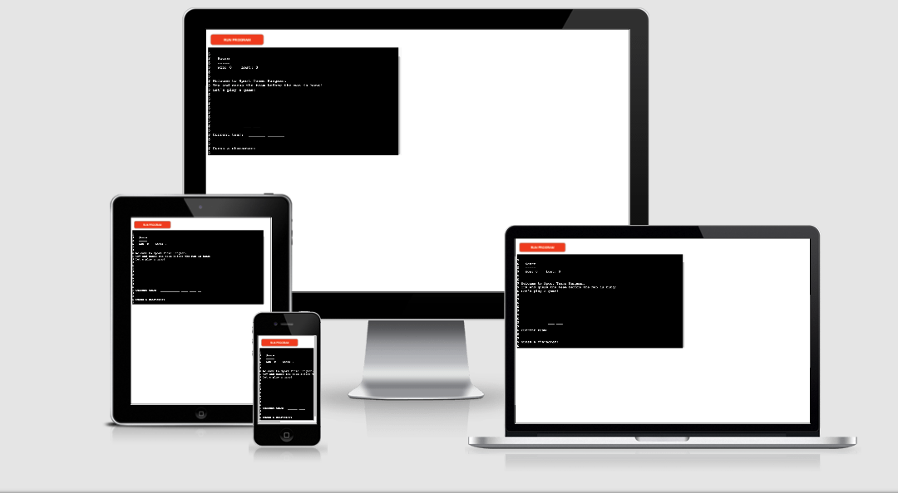
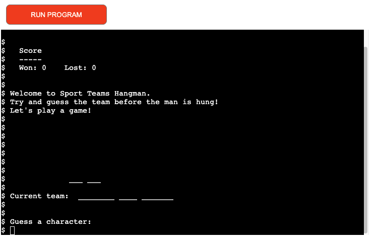
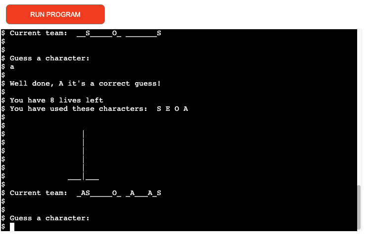
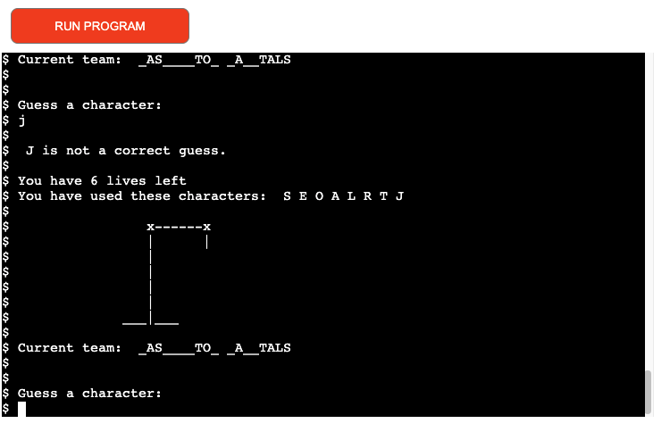
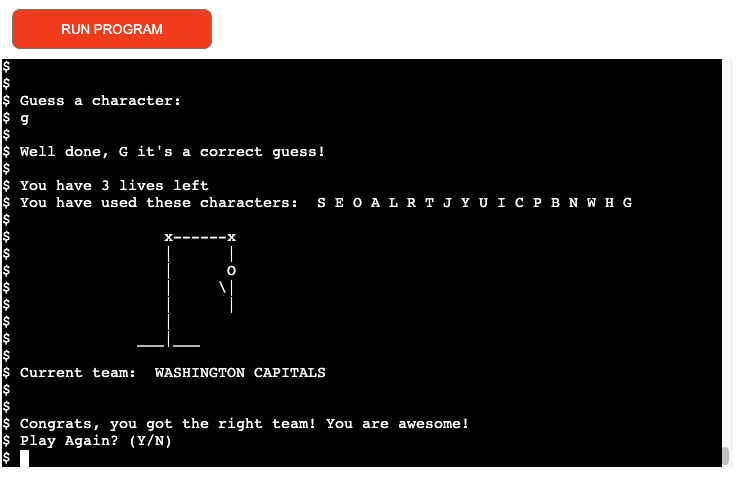
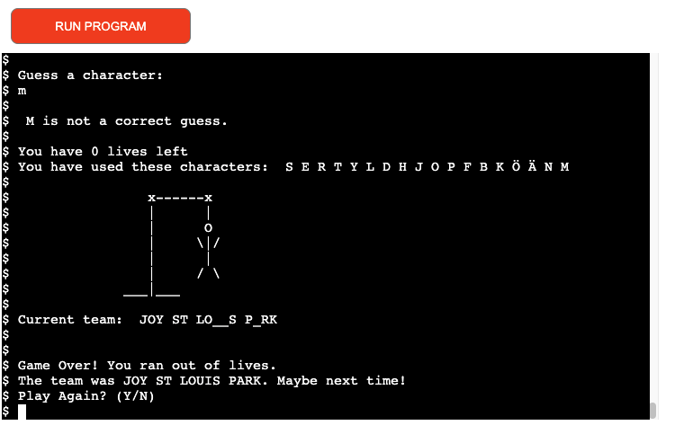
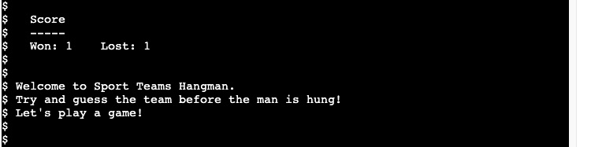

# SPORT TEAMS HANGMAN
---
Python - Milstone project 3 for Code Institute

  

[Link to game site](https://sporthangman.herokuapp.com/)

---
## Project Summary

Sport Teams Hangman is a word guessing game that runs in the terminal. It's a text-based game and the user will operate it from the command line. 

It´s up to the player to identify a hidden sport team. The sport teams are from USA leagues: NBA, NFL, NHL and NPSL. 

In each round, the player guesses a character (number or letter): if it's present in the word, all instances are revealed; otherwise one of the hangman's body parts is drawn in on a gibbet. The game ends in a win if the team is entirely revealed by correct guesses, and ends in loss if the hangman's body is completely revealed instead. To assist the player, a visible record of all guessed letters is typically maintained.

[Logic Flow Chart](assets/flowchart/flowchart.png)

[Wireframes](assets/wireframes/wireframe.png)

---
---
## Features:
---

### Existing Features:
---
#### Game Launch

When launching the game a score board and welcome text is displayed.
The welcome text provide the user with a short information on how to play the game. 
A initial state from where the hangman will display is prewritten from start.
The guess-line positioned under the hangman contains some underscore spaces (depending on how many words and characters there's in the secret team). The blanks/underscored space will be replaced with correct characters when guessed.
The current team is picked randomly from the teams.py file 
Below the current team is a input where the user can guess a character for the secret team. 

---
#### Correct Guess

When a character is correctly guessed, the user will get feedback that correct character has been picked. The correct character will be added to the current team as well to a line were all "used characters" is shown.

#### Wrong Guess

When user make a wrong guess feedback will be providen that the user made a wrong guess, and a part of the hangman illustration will be added to the board, and one game-life will be withdrawn. The huessed character will be added to "used characters".

---
#### Win Game

The game is won when the user has guessed the correct team before running out of game-life/chances. One score will be added to the win-side on the scoreboard.
The user will be asked if they want to play again. By pressing Y/N (yes/no) the user return their input. 

---
#### Game Over

The game is over and the hangman is hung when the user has made totaly 9 wrong guesses. The correct word/team will be displayd for feedback to the user. And one score will be added to the lost-side on the scoreboard.
The user will be asked if they want to play again. By pressing Y/N (yes/no) the user return their input. 

---
#### Score Board

The score board count the amount of wins and losses during a play session.
Once the game is restarted the counts will set back to zero.

___
### Features Left to Implement:
- Scoreboard that keep record of all users score.
- A 2 player option.
- Frontend features for a more appealing experience. 

---
----
## Technologies used:
---
### Languages:
- [Python](https://en.wikipedia.org/wiki/Python_(programming_language)) - To create a basic site.
### Framework libraries and programs:
- [Affinity Designer](https://affinity.serif.com/en-gb/) - For creating wireframes for initial visual development.
- [Lucidchart](https://www.lucidchart.com) - Used to create flowchart.
- [GitHub](https://pages.github.com/) - Used to host respository.
- [GitPod](https://gitpod.io/) - Used to develop project.
- [GitHub Pages](https://sndrahel.github.io/Hangman/) - Used to deploy this site.
- [Am I responsive](http://ami.responsivedesign.is/#) - Was used to generate a mockup for this readme.

---
---  
## Testing:
---
### Manual Testing:
- Function were tested within the terminal with a print statment to ensure the game ran as designed.
- All bugs/errors and problems that displayed during development were taken care of to make the game run as designed.
- The game is also tested through the Heroku app.  

### Validator Testing:
- [PEP8 Online](http://pep8online.com/) - Check your code for PEP8 requirements. = One error where found (line-length).

### This project was tested with the following browsers: 
- Laptop MacOS Big Sur (ver 11.4): Google Chrome

#### The following steps were taken:
- Test if the game starts and behaves as expected.
- Test if the game randomly picks a team from teams_list. 
- Test if the game replace underscores with correctly guessed characters. 
- Test if the game contains a visible list of used characters.
- Test if the hangman add on parts as designed.
- Test if the game withdraw/count life as expected. 
- Test if the win and loose function works as expected and display an option to play again.

---
### Issues / Unfixed Bugs:
---
- The main issues were the line lengt and the presence of whitespace. - Fixed! 
- The other main issue I had was to complete the function that discount the blank space between multiple words. - Fixed!
- One remaining issue is the line length on line 73. The line are over 79 characters. - Not fixed.

--- 

---
## Deployment
---
This application will be deployed via [Heroku](https://id.heroku.com/)
- Ensure all code is correct and ready for deployment.
- Enter the following code to import the required dependencies to the requirements.txt file: 
   ### pip3 freeze > requirements.txt
- Heroku will use this file to import the dependencies that are required.
- Log into Heroku or sign up for a free account.
- Signing up, for an account and wait to accept an authentication email.
- Navigate to Dashboard.
- Click "New" and select "create new app" from the drop-down menu. (Found in the top right corner of the window.)
- Provide a unique name for your application and select your region.
- Click "Create App".

## Setting up Heroku App
---
- Navigate to "Settings" and scroll down to "Buildpacks".
- Click "Buildpacks" and then click both "python" and "node.js"(node.js is needed for the mock terminal.)
- Take note of the order and ensure that the python build pack is above the node.js build pack, You can click and drag the packs to re-arrange them.

## Deployment through Heroku
---
- Navigate to the "Deploy" section.
- Scroll down to "Deployment Method" and select "GitHub".
- Authorize the connection of Heroku to GitHub.
- Search for your GitHub repository name, and select the correct repository.
- For Deployment there are two options, Automatic Deployments or Manual.
- Automatic Deployment: This will prompt Heroku to re-build your app each time you push your code to GitHub.
- Manual Deployment: This will only prompt Heroku to build your app when you manually tell it to do so.
- Ensure the correct branch is selected "master/Main", and select a deployment method. For this project I chose Manual Deployment.

## How to Fork the respository
---
- Log into GitHub.
- In Github go to (https://github.com/Sndrahel/Hangman).
- In the top right hand corner click "Fork".
- A copy of the repository will then be added to your repositories page.

## How to clone the repository
---
- Go to the GitHub repository.
- Locate the Code button which is to the left of the green gitpod button and click it.
- Select if you prefer to clone using HTTPS, SSH, or Github CLI and click the copy button to copy the URL to your clipboard.
- Open Git Bash.
- Change the current working directory to the one where you want the cloned directory.
- Type git clone and paste the URL from the clipboard.
- Press Enter to create your local clone.

--- 
---
## Credits
---

### Content:
- [Youtube](https://www.youtube.com/watch?v=m4nEnsavl6w) - The code as well as the hangman artwork are through out inspired and taken from this tutorial.  
- [GitHub](https://gist.github.com/jverbosky/a2e83d75bae7234e2342b3e6cfa72efe) - Inspiraton of the score system are taken from this site.
- [Stack Overflow](https://stackoverflow.com/) - Was used to find solutions and debugging.
- [Wikipedia](https://www.wikipedia.org/) - Were used to search and collect teams to the teams.py file.
- [GitHub](https://github.com/moirahartigan/the-scarecrows-wedding-portfolio-3/blob/main/README.md) - Inspiration of structure for this README file were adapted from this site. 
___    
---
## Acknowledgments:

- Nishant Kumar: My Code Institute mentor who guided me through this process and shared a lot of valuable knowledge.

